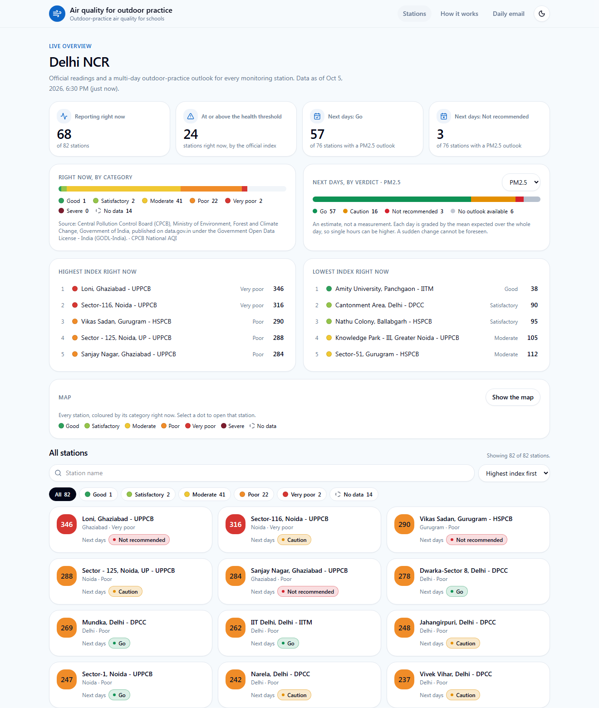
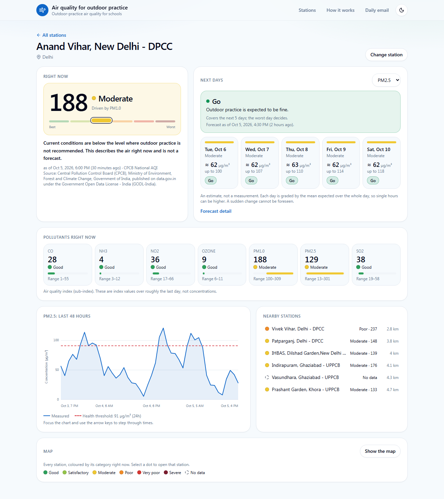
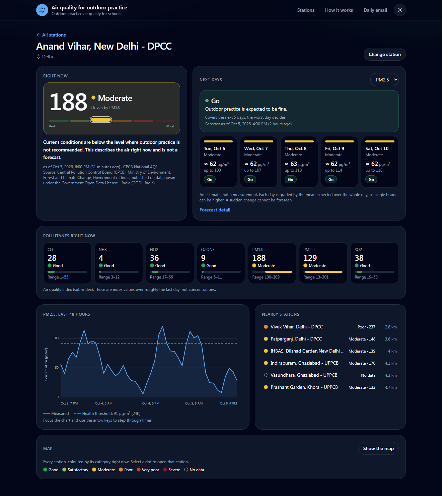
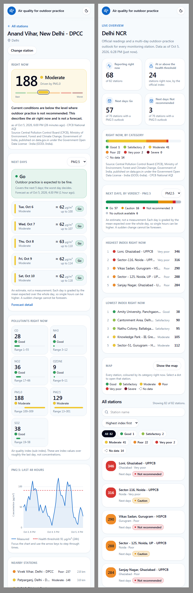

# Air Clear — air quality for outdoor practice

The web dashboard of a service that tells schools in Delhi NCR whether outdoor practice
is a good idea, station by station: the official reading right now and a graded outlook
for the next five days.

**Live:** https://air.himanshubaliyan.dev · **How it works:** https://air.himanshubaliyan.dev/about

The data pipeline, forecasting rule and API live in a separate repository:
[air-pollution-backend](https://github.com/himanshubaliyan7/air-pollution-backend).

| Region overview | Station dashboard |
| --- | --- |
|  |  |

| Dark theme | Phone (390 px) |
| --- | --- |
|  |  |

## What it shows

- **Region overview** (`/r/$regionId`): how many stations report, how many are at or above
  the health threshold, stations by category right now, stations by outlook verdict, the
  highest and lowest readings, and a searchable, filterable grid of every station.
- **Station dashboard** (`/r/$regionId/s/$stationId`): the current index on the category
  scale, the five-day outlook as a forecast strip, each pollutant with its range, the last
  48 hours as a chart, and the nearest stations.
- **Forecast detail**: the expected mean of each day with its likely range, and past
  forecasts against what was measured.
- **An optional map** (Leaflet + OpenStreetMap), downloaded only when the visitor opens it.
- **A daily email** with double opt-in, and **How it works**, which states the method and
  its measured accuracy.

## Design rules

- **The frontend decides nothing about air quality.** Every category, verdict, threshold
  and unit comes from the API. The code never names a category or a city; a second region
  with a different AQI standard needs no frontend change.
- **No data is never a clearance.** A missing, old or unrecognised verdict is shown as
  "no data" in neutral grey, and is covered by tests (`src/lib/recommendation.ts`,
  `src/lib/overview.ts`).
- **Colour is never the only signal.** Every coloured mark sits next to its label.
- **Light by default.** No chart or map library in the main bundle: the charts are
  hand-written SVG, and the map code loads on demand.
- **Accessible.** Keyboard-operable charts with a table alternative, visible focus, screen
  reader text for every figure, light and dark themes.

## Stack

TypeScript, React 19, TanStack Start (SSR) + Router + Query, Tailwind CSS 4, Vitest,
deployed to Cloudflare Workers. API types are generated from the backend's OpenAPI
document (`npm run gen:api`), so a contract change fails the type check.

## Development

```sh
npm install
npm run test        # Vitest unit tests
npx tsc --noEmit    # type check
npm run build
```

Set `VITE_API_BASE_URL` to the API base URL, no trailing slash (see `.env.example`). It
must be `https://`, and the API must allow this site's origin (CORS).

The API allows requests from the deployed site only. To develop against it locally, let
the dev server forward `/api`:

```sh
DEV_API_PROXY=https://air-api.himanshubaliyan.dev VITE_API_BASE_URL=http://localhost:5199 npx vite dev --port 5199
```

- `npm run gen:api` regenerates `src/api/schema.gen.ts` from `docs/openapi.json`. Run it
  after replacing `docs/openapi.json` with the backend's current document.
- `scripts/deploy-cloudflare.sh` builds and deploys to Cloudflare Workers.

Anything the API does not provide is recorded in `BACKEND_REQUESTS.md`, never faked.

## Layout

```
src/api          generated types, client, query cache policy
src/lib          pure functions (shaping, formatting, safety rules) and their tests
src/components   tiles, charts, map, shared states
src/routes       file-based routes
src/design       presentation tokens (the only place class names for colour live)
src/i18n         every user-facing string
```

## History

The first screens were generated with [Lovable](https://lovable.dev) from a written brief
and reviewed phase by phase; the dashboard, map, subscription pages and this redesign were
written by hand afterwards. A non-commercial portfolio project.
